# レプリカ交換法で巡回セールスマン問題を解く

書籍 [ゼロからできる MCMC](https://www.kspub.co.jp/book/detail/5201749.html) のサンプルコードを参考にして、FPGA で計算する回路を目指します。

最初に、書籍のサンプルコードを Python に翻訳、レプリカ交換を並列実行可能とするために N,N+1 の交換と N-1,N の交換を交互に実行するよう変更、その後に新ルートの提案アルゴリズムを [これ](http://www.nct9.ne.jp/m_hiroi/light/pyalgo64.html) を参考に 2-opt 法と簡易 or-opt 法のチクタクに変更しました。

その辺の経過は [こちらのリポジトリ](https://github.com/tom01h/TIL/tree/master/MCMC-Sample-Codes) にあります。

ここでは RTL 化を管理します。相変わらず管理がへたくそ…

### ブロック図

目指しているのはこんなの。50個並べる予定。

sim/ 下で 順序メモリを 32個並べて Python の結果と比較しています。次は Δ距離かな？



### アルゴリズムを簡単に説明

#### 簡易 or-opt 法

ルート中の k 番目の都市を l 番目の都市の後ろに移動する。

```
p = ordering[k]
ordering_fin = np.hstack((ordering[0:k], ordering[k+1:]))
ordering_fin = np.hstack((ordering_fin[0:l],   p, ordering_fin[l:]))
```


#### 2-opt 法

k-1 番目と k 番目の都市の接続と l-1 番目と l 番目の都市の接続を入れ替える (ただし k<l) 。

```
ordering_fin = np.hstack((ordering[0:k], ordering[k:l][::-1], ordering[l:]))
```


#### メトロポリス法

上記の交換で提案された新しいルートと、そのもとになったルートの距離の差を Δr としたときに、

```
min(1, exp(-Δr/T))
```

の確率で新ルートを採用する。

距離が短くなる時は 100% 受理、長くなるにつれて棄却率が高くなる。

温度 T によっても確率が変わる (温度が高いと受理する確率が上がる) 。


#### レプリカ交換法

複数の温度でメトロポリス法を実行。隣り合う温度のルートを交換する。温度が高いほうが距離が短ければ 100% 受理、長くなるにつれて棄却率が高くなる。並列処理をするために、交換は隣の温度と交互に実行。

