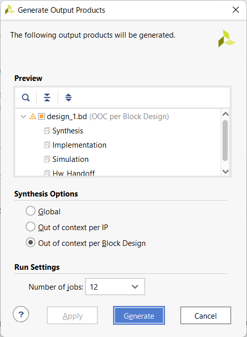

# FPGA で実行する

## Ultra96 or Kria (PYNQ2.7)

### ブロックデザインを作る

`replica_salesman/syn/U96` にて合成します

`replica_pkg.sv` は `node_num = 16;` を設定します。

[NahiViva](https://github.com/tokuden/NahiViva) で再現できるようにしました。説明は [こっち](http://nahitafu.cocolog-nifty.com/nahitafu/2019/05/post-2cfa5c.html) を見た方が良いかも。  
必要なファイルをダウンロードして、`open_project_gui.cmd` 実行でプロジェクトが再現されます。

### ファイルを転送する

FPGA の Linux に以下のファイルをコピーする

- replica_salesman_fpga.py
- setup.py
- lib.cpp
- top.py

FPGA の Linux に ~/bit ディレクトリを作成し、以下のファイルをリネームしてコピーする

`project_1\project_1.gen\sources_1\bd\design_1\hw_handoff` から

- design_1.hwh を replica_salesman.hwh にリネームしてコピー

- design_1_bd.tcl を replica_salesman.tcl にリネームしてコピー

`project_1\project_1.runs\impl_1` から

- design_1_wrapper.bit を replica_salesman.bit にリネームしてコピー

### 実行する

最初の1回だけ準備が必要

```
$ python3 setup.py build_ext -i
```

その後は、

Ultra96は

```
$ sudo -E python3 replica_salesman_fpga.py
```

Kria は

```
$ sudo PATH=$PATH python3 replica_salesman_fpga.py
```

## LITEFURY

### ブロックデザインを作る

`replica_salesman/syn/LiteFury` にて合成します

`replica_pkg.sv` は `node_num = 8;` を設定します。

NahiViva を Linux で使う場合は [Vivadoを自動化するTclスクリプトをLinuxでも使う - Qiita](https://qiita.com/nahitafu/items/818569ba72ab1c39def3) を参考に。

### ファイルを転送する

FPGA 用の Linux に以下のファイルをコピーする

- replica_salesman_pcie.py
- setup.py
- lib.cpp
- top_pcie.py

### FPGA の準備をする

Vivado から bit データを書き込む

PCIe をリスキャンする

xdma ドライバをロードする

詳しくは [tom01h/LiteFury (github.com)](https://github.com/tom01h/LiteFury) 参照

### 実行する

最初の1回だけ準備が必要

```
$ python3 setup.py build_ext -i
```

その後は、

```
$ sudo python3 replica_salesman_pcie.py
```

## Arty or CoreBoard

### ブロックデザインを作る

`replica_salesman/syn/Arty or CoreBoard` にて合成します

**Arty**`replica_pkg.sv` は `node_num = 4;` を設定します。

**CoreBoard**`replica_pkg.sv` は `node_num = 16;` を設定します。  
CoreBoardで合成はBRAM不足をLUTRAMで補うため、ブロックデザインを右クリックで出てくる`Generating Output Products`ダイアログから`Out of context per Block Design`を選ぶ  


### データ転送用の Raspberry Pi Pico を準備する

[tom01h/xvc-pico (github.com)](https://github.com/tom01h/xvc-pico) の pico 用のファームウェアを使う

### ファイルを転送する

FPGA 用の Linux に以下のファイルをコピーする

- replica_salesman_pico.py
- setup.py
- setup_pico.py
- lib.cpp
- top_pico.py

### FPGA の準備をする

Vivado から bit データを書き込む

### 実行する

最初の1回だけ準備が必要

```
$ python3 setup.py build_ext -i
$ python3 setup_pico.py build_ext -i -I/usr/include/libusb-1.0/
```

その後は、

```
$ sudo python3 replica_salesman_pico.py
```

CoreBoard では `replica_salesman_pico.py` に `node_num = 16` を設定します
